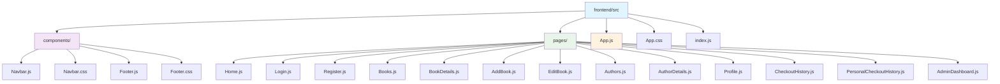
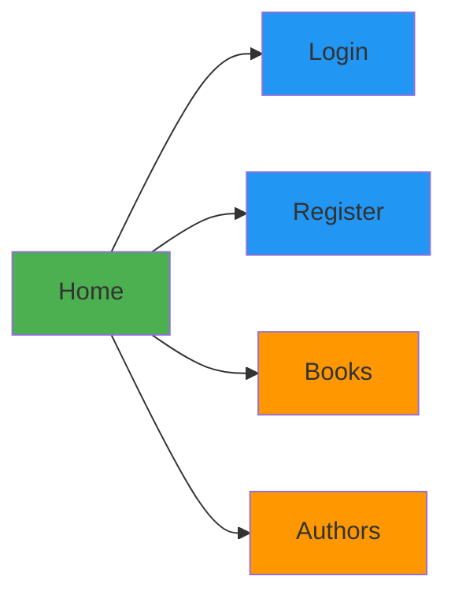
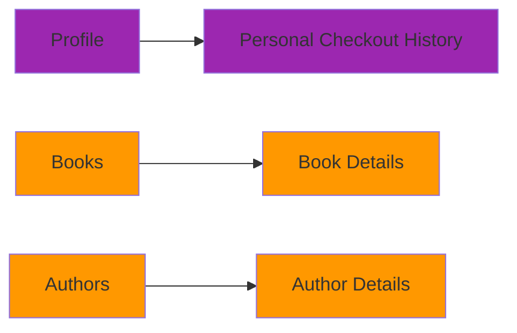
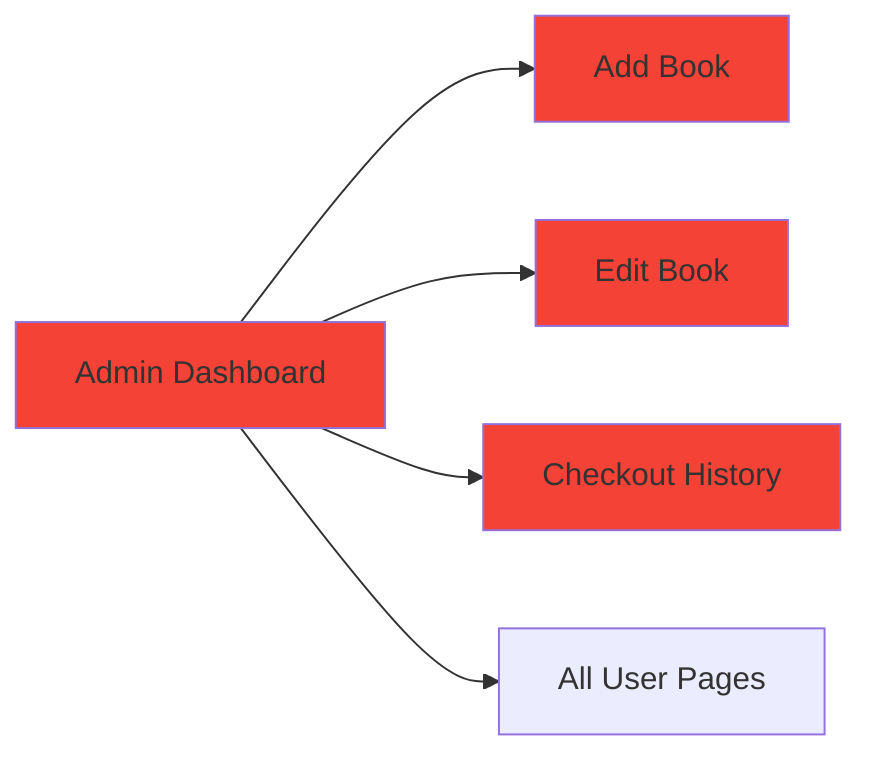
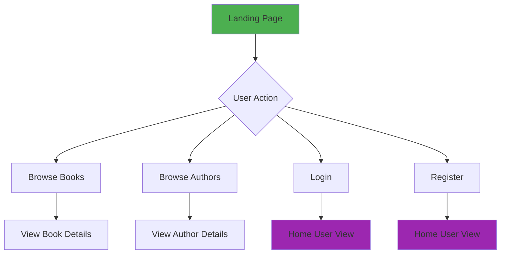
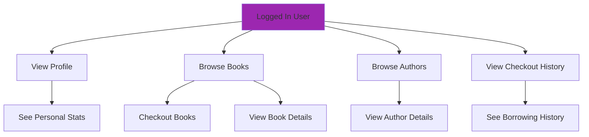
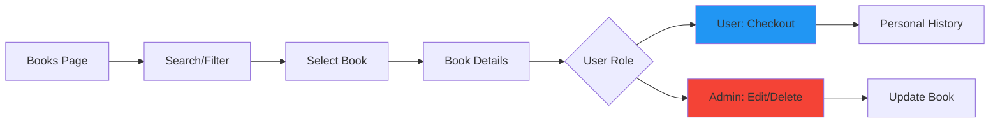
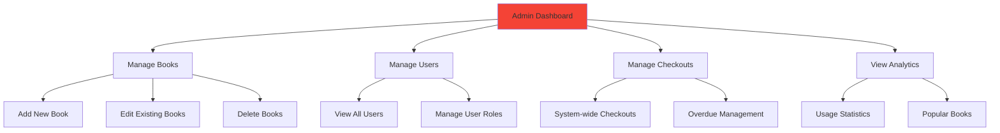
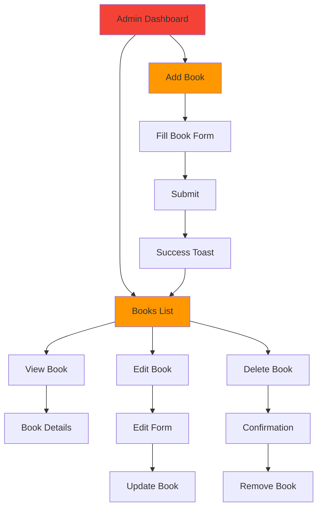
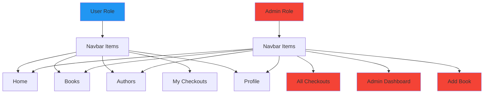

# Library Management System - Complete Documentation

## 📋 Table of Contents
1. [Project Overview](#project-overview)
2. [File Structure](#file-structure)
3. [Page Components & Use Cases](#page-components--use-cases)
4. [User Flows](#user-flows)
5. [Admin Flows](#admin-flows)
6. [Backend Integration Guide](#backend-integration-guide)

## 🏗️ Project Overview

A full-stack MERN Library Management System with 15 pages featuring role-based access control, responsive design, and modern UI/UX.

### Tech Stack
- **Frontend**: React, CSS3, JavaScript
- **Backend**: Node.js, Express.js, MongoDB
- **Authentication**: JWT-based role system

## 📁 File Structure



### Complete File Structure
```
frontend/src/
├── components/
│   ├── Navbar.js              # Navigation with role-based links
│   ├── Navbar.css
│   ├── Footer.js              # Fixed footer component
│   └── Footer.css
├── pages/
│   ├── Home.js                # Landing page (guest/user views)
│   ├── Home.css
│   ├── Login.js               # User authentication
│   ├── Login.css
│   ├── Register.js            # User registration
│   ├── Register.css
│   ├── Books.js               # Book catalog with search/filter
│   ├── Books.css
│   ├── BookDetails.js         # Individual book information
│   ├── BookDetails.css
│   ├── AddBook.js             # Admin book creation form
│   ├── AddBook.css
│   ├── EditBook.js            # Admin book editing form
│   ├── EditBook.css
│   ├── Authors.js             # Author directory
│   ├── Authors.css
│   ├── AuthorDetails.js       # Individual author information
│   ├── AuthorDetails.css
│   ├── Profile.js             # User profile and stats
│   ├── Profile.css
│   ├── CheckoutHistory.js     # Admin: system-wide checkout management
│   ├── CheckoutHistory.css
│   ├── PersonalCheckoutHistory.js # User: personal borrowing history
│   ├── PersonalCheckoutHistory.css
│   ├── AdminDashboard.js      # Admin overview with stats
│   └── AdminDashboard.css
├── App.js                     # Main app component with routing
├── App.css                    # Global styles + testing controls
├── index.js                   # React entry point
└── index.css                  # Global reset and base styles
```

## 🎯 Page Components & Use Cases

### Public Pages (No Login Required)


| Page | Use Case | Key Features |
|------|----------|--------------|
| **Home** | Landing page | Guest/User view toggle, feature cards |
| **Login** | User authentication | Form validation, password visibility |
| **Register** | User registration | Form validation, success states |
| **Books** | Book catalog | Search, filter, grid layout |
| **Authors** | Author directory | Table view, search, pagination |

### User Pages (After Login)


| Page | Use Case | Key Features |
|------|----------|--------------|
| **Profile** | User management | Personal stats, role badge |
| **Personal Checkout History** | Borrowing records | User-specific data, status badges |
| **Book Details** | Book information | Checkout functionality, details card |
| **Author Details** | Author information | Biography, books list |

### Admin Pages (Admin Role Only)


| Page | Use Case | Key Features |
|------|----------|--------------|
| **Admin Dashboard** | System overview | Stats cards, quick actions, sidebar nav |
| **Add Book** | Book creation | Form validation, success toast |
| **Edit Book** | Book modification | Pre-filled forms, update functionality |
| **Checkout History** | System management | Admin view of all checkouts, filters |

## 🔄 User Flows

### Guest User Flow


### Authenticated User Flow


### Book Interaction Flow


## 👨‍💼 Admin Flows

### Admin System Management


### Book Management Flow


## 🔐 Role Differentiation

### Navigation Differences


### Page Access Matrix
| Page | Guest | User | Admin |
|------|-------|------|-------|
| Home | ✅ | ✅ | ✅ |
| Login | ✅ | ❌ | ❌ |
| Register | ✅ | ❌ | ❌ |
| Books | ✅ | ✅ | ✅ |
| Book Details | ✅ | ✅ | ✅ |
| Authors | ✅ | ✅ | ✅ |
| Author Details | ✅ | ✅ | ✅ |
| Profile | ❌ | ✅ | ✅ |
| Personal Checkout History | ❌ | ✅ | ✅ |
| Admin Dashboard | ❌ | ❌ | ✅ |
| Add Book | ❌ | ❌ | ✅ |
| Edit Book | ❌ | ❌ | ✅ |
| Checkout History | ❌ | ❌ | ✅ |

## 🔗 Backend Integration Guide

### Step 1: Setup Dependencies

**Install required packages:**
```bash
cd frontend
npm install axios
```

### Step 2: Create API Service Layer

**File: `frontend/src/services/api.js`**
```javascript
import axios from 'axios';

// Base API configuration
const API_BASE_URL = 'http://localhost:5000/api'; // Adjust to your backend URL

// Create axios instance with default config
const api = axios.create({
  baseURL: API_BASE_URL,
  timeout: 10000,
  headers: {
    'Content-Type': 'application/json',
  },
});

// Request interceptor to add auth token
api.interceptors.request.use(
  (config) => {
    const token = localStorage.getItem('authToken');
    if (token) {
      config.headers.Authorization = `Bearer ${token}`;
    }
    return config;
  },
  (error) => {
    return Promise.reject(error);
  }
);

// Response interceptor for error handling
api.interceptors.response.use(
  (response) => response,
  (error) => {
    if (error.response?.status === 401) {
      // Token expired or invalid
      localStorage.removeItem('authToken');
      window.location.href = '/#login';
    }
    return Promise.reject(error);
  }
);

// API endpoints object
export const API_ENDPOINTS = {
  // Auth endpoints
  AUTH: {
    LOGIN: '/auth/login',
    REGISTER: '/auth/register',
    PROFILE: '/auth/profile',
    LOGOUT: '/auth/logout',
  },
  
  // Book endpoints
  BOOKS: {
    GET_ALL: '/books',
    GET_ONE: (id) => `/books/${id}`,
    CREATE: '/books',
    UPDATE: (id) => `/books/${id}`,
    DELETE: (id) => `/books/${id}`,
    SEARCH: '/books/search',
  },
  
  // Author endpoints
  AUTHORS: {
    GET_ALL: '/authors',
    GET_ONE: (id) => `/authors/${id}`,
    CREATE: '/authors',
    UPDATE: (id) => `/authors/${id}`,
    DELETE: (id) => `/authors/${id}`,
  },
  
  // Checkout endpoints
  CHECKOUTS: {
    GET_ALL: '/checkouts',
    GET_MY: '/checkouts/my',
    CREATE: '/checkouts',
    RETURN: (id) => `/checkouts/${id}/return`,
  },
  
  // User endpoints (admin only)
  USERS: {
    GET_ALL: '/users',
    GET_ONE: (id) => `/users/${id}`,
    UPDATE_ROLE: (id) => `/users/${id}/role`,
  },
  
  // Dashboard stats
  DASHBOARD: {
    STATS: '/dashboard/stats',
  }
};

export default api;
```

### Step 3: Update App.js for Real Authentication

**File: `frontend/src/App.js`** (Updated with real auth)
```javascript
import React, { useState, useEffect } from 'react';
import { API_ENDPOINTS, api } from './services/api';
// ... other imports

function App() {
  const [currentPage, setCurrentPage] = useState('home');
  const [isLoggedIn, setIsLoggedIn] = useState(false);
  const [userRole, setUserRole] = useState('user');
  const [userData, setUserData] = useState(null);
  const [loading, setLoading] = useState(true);

  // Check authentication on app load
  useEffect(() => {
    checkAuthentication();
  }, []);

  const checkAuthentication = async () => {
    const token = localStorage.getItem('authToken');
    if (token) {
      try {
        const response = await api.get(API_ENDPOINTS.AUTH.PROFILE);
        setIsLoggedIn(true);
        setUserRole(response.data.role);
        setUserData(response.data);
      } catch (error) {
        console.error('Auth check failed:', error);
        localStorage.removeItem('authToken');
      }
    }
    setLoading(false);
  };

  // Real login function
  const handleLogin = async (email, password) => {
    try {
      setLoading(true);
      const response = await api.post(API_ENDPOINTS.AUTH.LOGIN, {
        email,
        password
      });
      
      const { token, user } = response.data;
      localStorage.setItem('authToken', token);
      setIsLoggedIn(true);
      setUserRole(user.role);
      setUserData(user);
      setCurrentPage('home');
      
    } catch (error) {
      console.error('Login failed:', error);
      throw error; // Let Login component handle the error
    } finally {
      setLoading(false);
    }
  };

  // Real register function
  const handleRegister = async (userData) => {
    try {
      setLoading(true);
      const response = await api.post(API_ENDPOINTS.AUTH.REGISTER, userData);
      
      const { token, user } = response.data;
      localStorage.setItem('authToken', token);
      setIsLoggedIn(true);
      setUserRole(user.role);
      setUserData(user);
      setCurrentPage('home');
      
    } catch (error) {
      console.error('Registration failed:', error);
      throw error;
    } finally {
      setLoading(false);
    }
  };

  // Real logout function
  const handleLogout = async () => {
    try {
      await api.post(API_ENDPOINTS.AUTH.LOGOUT);
    } catch (error) {
      console.error('Logout error:', error);
    } finally {
      localStorage.removeItem('authToken');
      setIsLoggedIn(false);
      setUserRole('user');
      setUserData(null);
      setCurrentPage('home');
    }
  };

  // ... rest of the component

  if (loading) {
    return <div className="loading-screen">Loading...</div>;
  }

  return (
    // ... JSX structure
  );
}
```

### Step 4: Update Login Component

**File: `frontend/src/pages/Login.js`** (Updated with real API)
```javascript
import React, { useState } from 'react';
import './Login.css';

const Login = ({ onLogin, onNavigate }) => {
  const [formData, setFormData] = useState({
    email: '',
    password: ''
  });
  const [loading, setLoading] = useState(false);
  const [error, setError] = useState('');

  const handleSubmit = async (e) => {
    e.preventDefault();
    setLoading(true);
    setError('');

    try {
      await onLogin(formData.email, formData.password);
      // Success handled by parent
    } catch (error) {
      setError(error.response?.data?.message || 'Login failed. Please try again.');
    } finally {
      setLoading(false);
    }
  };

  return (
    <div className="login-container">
      {/* Error message display */}
      {error && (
        <div className="error-message">
          <span className="material-symbols-outlined">error</span>
          {error}
        </div>
      )}
      
      {/* Rest of the form */}
      <form className="login-form" onSubmit={handleSubmit}>
        {/* Form fields */}
        <button 
          type="submit" 
          className="login-button"
          disabled={loading}
        >
          {loading ? 'Logging in...' : 'Login'}
        </button>
      </form>
    </div>
  );
};
```

### Step 5: Update Books Component with Real Data

**File: `frontend/src/pages/Books.js`** (Updated with API calls)
```javascript
import React, { useState, useEffect } from 'react';
import { API_ENDPOINTS, api } from '../services/api';
import './Books.css';

const Books = ({ onNavigate }) => {
  const [books, setBooks] = useState([]);
  const [loading, setLoading] = useState(true);
  const [error, setError] = useState('');
  const [searchQuery, setSearchQuery] = useState('');

  // Fetch books on component mount
  useEffect(() => {
    fetchBooks();
  }, []);

  const fetchBooks = async () => {
    try {
      setLoading(true);
      const response = await api.get(API_ENDPOINTS.BOOKS.GET_ALL);
      setBooks(response.data);
    } catch (error) {
      setError('Failed to load books');
      console.error('Error fetching books:', error);
    } finally {
      setLoading(false);
    }
  };

  const handleCheckout = async (bookId) => {
    try {
      await api.post(API_ENDPOINTS.CHECKOUTS.CREATE, { bookId });
      // Show success message or update UI
      alert('Book checked out successfully!');
      // Refresh books to update availability
      fetchBooks();
    } catch (error) {
      alert(error.response?.data?.message || 'Checkout failed');
    }
  };

  const handleSearch = async (query) => {
    try {
      const response = await api.get(API_ENDPOINTS.BOOKS.SEARCH, {
        params: { q: query }
      });
      setBooks(response.data);
    } catch (error) {
      console.error('Search failed:', error);
    }
  };

  if (loading) return <div className="loading">Loading books...</div>;
  if (error) return <div className="error">{error}</div>;

  return (
    // JSX with real data
    <div className="books-container">
      {/* Search and controls */}
      <div className="books-controls">
        <input
          type="text"
          placeholder="Search by book title..."
          value={searchQuery}
          onChange={(e) => {
            setSearchQuery(e.target.value);
            handleSearch(e.target.value);
          }}
        />
      </div>

      {/* Books grid */}
      <div className="books-grid">
        {books.map(book => (
          <div key={book._id} className="book-card">
            
            <h3>{book.title}</h3>
            <p>{book.author}</p>
            <button 
              onClick={() => handleCheckout(book._id)}
              disabled={!book.available}
            >
              {book.available ? 'Checkout' : 'Unavailable'}
            </button>
          </div>
        ))}
      </div>
    </div>
  );
};
```

### Step 6: Update Admin Dashboard with Real Stats

**File: `frontend/src/pages/AdminDashboard.js`** (Updated with API)
```javascript
import React, { useState, useEffect } from 'react';
import { API_ENDPOINTS, api } from '../services/api';
import './AdminDashboard.css';

const AdminDashboard = ({ onNavigate }) => {
  const [stats, setStats] = useState({
    totalUsers: 0,
    totalAuthors: 0,
    totalBooks: 0,
    activeCheckouts: 0
  });
  const [loading, setLoading] = useState(true);

  useEffect(() => {
    fetchDashboardStats();
  }, []);

  const fetchDashboardStats = async () => {
    try {
      const response = await api.get(API_ENDPOINTS.DASHBOARD.STATS);
      setStats(response.data);
    } catch (error) {
      console.error('Failed to fetch dashboard stats:', error);
    } finally {
      setLoading(false);
    }
  };

  if (loading) return <div>Loading dashboard...</div>;

  return (
    <div className="admin-dashboard-container">
      {/* Stats grid with real data */}
      <div className="stats-grid">
        <div className="stat-card">
          <h3>{stats.totalUsers}</h3>
          <p>Total Users</p>
        </div>
        <div className="stat-card">
          <h3>{stats.totalAuthors}</h3>
          <p>Total Authors</p>
        </div>
        <div className="stat-card">
          <h3>{stats.totalBooks}</h3>
          <p>Total Books</p>
        </div>
        <div className="stat-card">
          <h3>{stats.activeCheckouts}</h3>
          <p>Active Checkouts</p>
        </div>
      </div>
      {/* Rest of the component */}
    </div>
  );
};
```

### Step 7: Update Profile Component

**File: `frontend/src/pages/Profile.js`** (Updated with API)
```javascript
import React, { useState, useEffect } from 'react';
import { API_ENDPOINTS, api } from '../services/api';
import './Profile.css';

const Profile = ({ onNavigate, isLoggedIn, userRole }) => {
  const [userData, setUserData] = useState(null);
  const [userStats, setUserStats] = useState({ booksCheckedOut: 0 });
  const [loading, setLoading] = useState(true);

  useEffect(() => {
    if (isLoggedIn) {
      fetchUserData();
      fetchUserStats();
    }
  }, [isLoggedIn]);

  const fetchUserData = async () => {
    try {
      const response = await api.get(API_ENDPOINTS.AUTH.PROFILE);
      setUserData(response.data);
    } catch (error) {
      console.error('Failed to fetch user data:', error);
    }
  };

  const fetchUserStats = async () => {
    try {
      const response = await api.get(API_ENDPOINTS.CHECKOUTS.GET_MY);
      const activeCheckouts = response.data.filter(checkout => checkout.status === 'active').length;
      setUserStats({ booksCheckedOut: activeCheckouts });
    } catch (error) {
      console.error('Failed to fetch user stats:', error);
    } finally {
      setLoading(false);
    }
  };

  if (!isLoggedIn) {
    return (
      <div className="not-logged-in">
        <h2>Please log in to view your profile</h2>
        <button onClick={() => onNavigate('login')}>Go to Login</button>
      </div>
    );
  }

  if (loading) return <div>Loading profile...</div>;

  return (
    <div className="profile-container">
      <div className="profile-card">
        <div className="user-info">
          <h2>{userData?.name}</h2>
          <p>{userData?.email}</p>
        </div>
        <div className="stats">
          <div className="stat">
            <span className="stat-number">{userStats.booksCheckedOut}</span>
            <span className="stat-label">Books Checked Out</span>
          </div>
          <div className="stat">
            <span className={`role-badge ${userRole}`}>
              {userRole}
            </span>
            <span className="stat-label">Role</span>
          </div>
        </div>
      </div>
    </div>
  );
};
```

## 📝 API Integration Best Practices

### ✅ DOs:
```javascript
// ✅ Use async/await for better readability
const fetchData = async () => {
  try {
    const response = await api.get('/endpoint');
    return response.data;
  } catch (error) {
    handleError(error);
  }
};

// ✅ Handle loading states
const [loading, setLoading] = useState(false);
const [data, setData] = useState(null);

// ✅ Use proper error handling
try {
  const result = await apiCall();
} catch (error) {
  if (error.response?.status === 404) {
    // Handle not found
  } else if (error.response?.status === 401) {
    // Handle unauthorized
  } else {
    // Handle generic error
  }
}

// ✅ Implement request cancellation
useEffect(() => {
  const controller = new AbortController();
  
  const fetchData = async () => {
    try {
      const response = await api.get('/endpoint', {
        signal: controller.signal
      });
      setData(response.data);
    } catch (error) {
      if (error.name !== 'AbortError') {
        handleError(error);
      }
    }
  };
  
  fetchData();
  
  return () => controller.abort();
}, []);
```

### ❌ DON'Ts:
```javascript
// ❌ Don't forget error handling
const badFetch = async () => {
  const response = await api.get('/endpoint'); // No try/catch!
  setData(response.data);
};

// ❌ Don't make API calls in render
const Component = () => {
  const [data, setData] = useState(null);
  
  // Wrong! This will cause infinite re-renders
  api.get('/endpoint').then(response => setData(response.data));
  
  return <div>{data}</div>;
};

// ❌ Don't ignore loading states
const noLoading = async () => {
  // User won't know something is happening
  const data = await apiCall();
  setData(data);
};

// ❌ Don't store sensitive data in state without cleanup
const unsafeStorage = () => {
  const [userData, setUserData] = useState(null);
  
  // Sensitive data remains in memory
  return <div>{userData.password}</div>; // Never do this!
};
```

### Advanced Patterns:

#### 1. Custom Hook for API Calls
```javascript
// hooks/useApi.js
import { useState, useEffect } from 'react';
import { api } from '../services/api';

export const useApi = (url, options = {}) => {
  const [data, setData] = useState(null);
  const [loading, setLoading] = useState(true);
  const [error, setError] = useState(null);

  useEffect(() => {
    const fetchData = async () => {
      try {
        setLoading(true);
        setError(null);
        const response = await api.get(url, options);
        setData(response.data);
      } catch (err) {
        setError(err);
      } finally {
        setLoading(false);
      }
    };

    fetchData();
  }, [url]);

  return { data, loading, error };
};

// Usage in component:
const Books = () => {
  const { data: books, loading, error } = useApi('/books');
  
  if (loading) return <div>Loading...</div>;
  if (error) return <div>Error: {error.message}</div>;
  
  return (
    <div>
      {books.map(book => (
        <div key={book._id}>{book.title}</div>
      ))}
    </div>
  );
};
```

#### 2. Optimistic Updates
```javascript
const [books, setBooks] = useState([]);

const deleteBook = async (bookId) => {
  // Optimistically update UI
  const previousBooks = books;
  setBooks(books.filter(book => book._id !== bookId));
  
  try {
    await api.delete(`/books/${bookId}`);
  } catch (error) {
    // Revert on error
    setBooks(previousBooks);
    alert('Failed to delete book');
  }
};
```

## 🚀 Backend API Expectations

Your backend should provide these endpoints:

### Authentication
- `POST /api/auth/login` - User login
- `POST /api/auth/register` - User registration  
- `GET /api/auth/profile` - Get user profile
- `POST /api/auth/logout` - User logout

### Books
- `GET /api/books` - Get all books
- `GET /api/books/:id` - Get single book
- `POST /api/books` - Create book (admin)
- `PUT /api/books/:id` - Update book (admin)
- `DELETE /api/books/:id` - Delete book (admin)
- `GET /api/books/search` - Search books

### Authors
- `GET /api/authors` - Get all authors
- `GET /api/authors/:id` - Get single author

### Checkouts
- `GET /api/checkouts` - Get all checkouts (admin)
- `GET /api/checkouts/my` - Get user's checkouts
- `POST /api/checkouts` - Create checkout
- `PUT /api/checkouts/:id/return` - Return book

### Dashboard
- `GET /api/dashboard/stats` - Get dashboard statistics

## 🎯 Next Steps

1. **Implement the API service layer**
2. **Update each component with real API calls**
3. **Add proper error boundaries**
4. **Implement loading skeletons**
5. **Add form validation**
6. **Set up environment variables**
7. **Add API documentation**

This comprehensive guide provides everything you need to integrate your frontend with a backend API! 🚀
